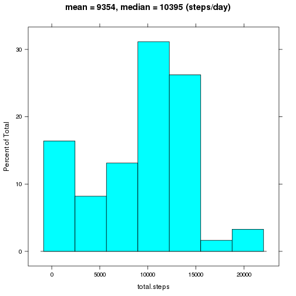
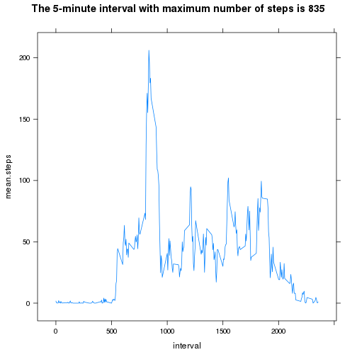
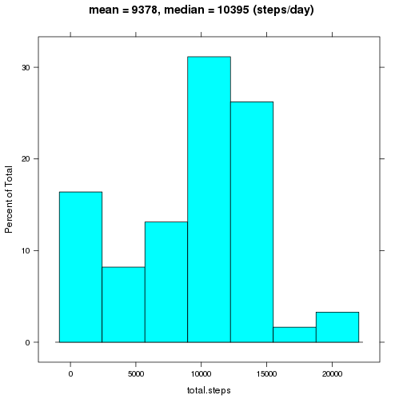
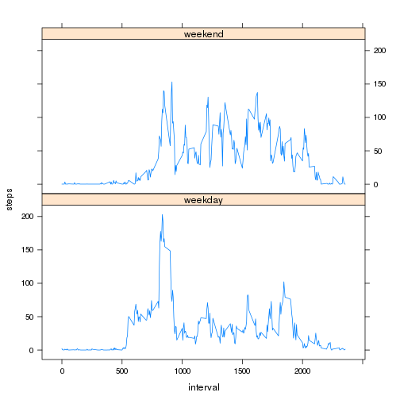

# Reproducible Research: Peer Assessment 1

```r
library(lattice)
library(reshape)
```

## Loading and preprocessing the data

```r
data <- read.csv(unz("activity.zip","activity.csv"))
str(data)
```

```
## 'data.frame':	17568 obs. of  3 variables:
##  $ steps   : int  NA NA NA NA NA NA NA NA NA NA ...
##  $ date    : Factor w/ 61 levels "2012-10-01","2012-10-02",..: 1 1 1 1 1 1 1 1 1 1 ...
##  $ interval: int  0 5 10 15 20 25 30 35 40 45 ...
```

## What is the total number of steps taken per day?

```r
total.steps <- sapply(split(data$steps, data$date), sum, na.rm = TRUE)
histogram(total.steps, 
          main = sprintf("mean = %.0f, median = %.0f (steps/day)", 
                         mean(total.steps), median(total.steps)))
```

 

## What is the average daily activity pattern?

```r
mean.steps <- tapply(data$steps, data$interval, mean, na.rm = TRUE)
interval <- as.integer(names(mean.steps))
max <- which.max(mean.steps)[[1]]
xyplot(mean.steps ~ interval, type = "l",
       main = sprintf(
           "The 5-minute interval with maximum number of steps is %d",
           interval[max]))
```

 

## Imputing missing values
The total number of missing values in the dataset is: **2304**. Each of the missing values will be filled with the mean value for the day to which the missing value belongs.

```r
# fill each missing value with the mean value for the day
na <- is.na(data$steps)
data$steps[na] = mean.steps[data$date[na]]

# compute and plot the total steps/day for the new data
total.steps <- sapply(split(data$steps, data$date), sum, na.rm = TRUE)
histogram(total.steps, 
          main = sprintf("mean = %.0f, median = %.0f (steps/day)", 
                         mean(total.steps), median(total.steps)))
```

 

## Are there differences in activity patterns between weekdays and weekends?

```r
# compute steps/day for each pair of interval and day type (weekday/weekend)
day <- weekdays(as.POSIXct(data$date))
weekend <- day == "Saturday" | day == "Sunday"
weekday <- !weekend
day[weekend] <- "weekend"
day[weekday] <- "weekday"
steps <- tapply(data$steps, list(data$interval, day), mean)

# reshape and plot
steps <- melt(steps)
names(steps) <- c("interval", "day", "steps")
xyplot(steps ~ interval | day, steps, type = "l", layout = c(1,2))
```

 
